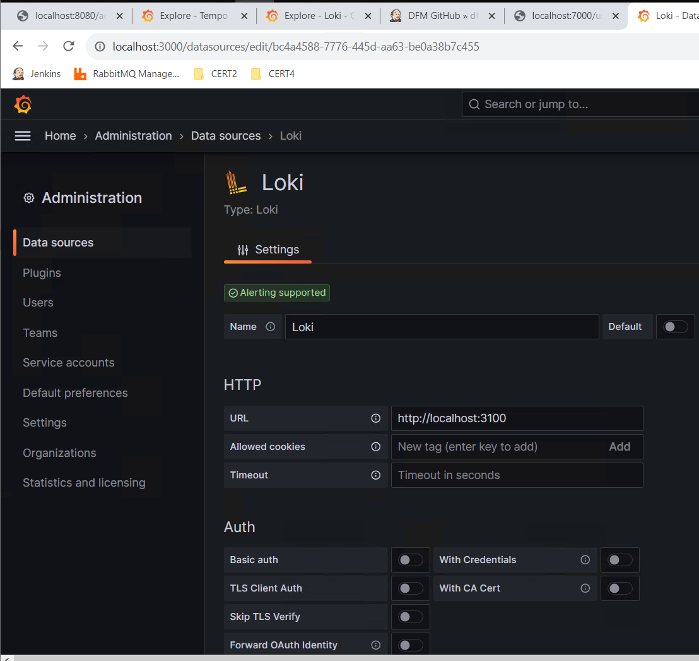
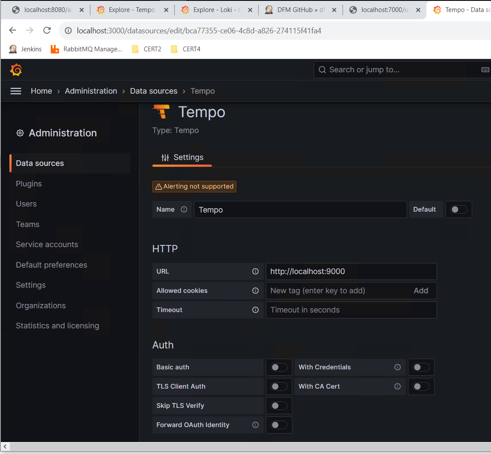

# distributed-tracing-logging
Spring boot application for distributed tracing and logging using Grafana, Tempo and Loki

**distributed-tracing-logging** is a multi-module spring boot application to integrate distributed tracing and distributed logging features to Spring Boot microservices.
This maven based project has two modules: **user-service** and **address-service** each representing an microservice.

# user-service
A simple service which retrieves user details, calls **address-service** for user's address details. This is a dummy service returns same response on each call.   
&emsp;**GET:** http://localhost:7000/user/123   
&emsp;**Response:** {"name":"123","address":{"field":"123"}}   
 
# address-service
A simple service which retrieves an user's address, called by **user-service** for user's address details. This is a dummy service returns same response on each call.  

# Build steps
Build user-service and address-service as war artifacts.  
&emsp;mvn clean install 

# Logging configuration
Loki and Promtail are required for distributed logging. 
&emsp;-> Start Loki followed by Promtail 
&emsp;-> Start Promtail: promtail-windows-amd64.exe -**-config.file=promtail-local-config.yml** 
&emsp;-> Promtail config file: **config_files\promtail-local-config.yml** 
&emsp;-> Start Loki: loki-windows-amds64.exe **--config.file=loki-local-config.yml** 
&emsp;-> Loki config file: **config_files\loki-local-config.yml** 
# Tracing configuration
Download Tempo for windows: 
&emsp;-> Go to: https://github.com/grafana/tempo/releases 
&emsp;-> Expand "Assests" section to find binary for windows 
&emsp;-> Link to binary: https://github.com/grafana/tempo/releases/download/v2.3.0/tempo_2.3.0_windows_amd64.tar.gz 
&emsp;-> Start Tempo: tempo.exe **-config.file=tempo.yml** 
&emsp;-> Tempo config file: **config_files\tempo.yml** 
# Grafana configure Loki and Tempo as datasource
Start Grafana: grafana-server.exe 
&emsp;-> Configure Loki datasource: Give URL as : http://localhost:3100 

&emsp;-> Configure Tempo datasource: Give URL as : http://localhost:9000 

# Create spring boot services with dependencies and configuration
Create two service: user-service and address-service 
&emsp;-> user-service calls address-service for address related information 
 Endpoint exposed by user-service 
&emsp;->GET: http://localhost:7000/user/123 
&emsp;->Response: {"name":"123","address":{"field":"123"}} 
 Maven dependencies added: 
&emsp;->spring-cloud-starter-sleuth	:  
&emsp;->spring-cloud-sleuth-otel-autoconfigure 
&emsp;->opentelemetry-exporter-otlp 
 application.properties 
&emsp;->spring.application.name=user-service 
&emsp;->spring.sleuth.otel.config.trace-id-ratio-based=1.0 
&emsp;->spring.sleuth.otel.exporter.otlp.endpoint=http://localhost:4317 	
 logback.xml 
&emsp;<encoder> 
&emsp;&emsp;<pattern>%d{yyyy-MM-dd HH:mm:ss.SSS, GMT} %p [ traceid=%X{traceId} spanid=%X{spanId} ] %c{1.} [%t] %m%n</pattern> 
&emsp;</encoder> 
